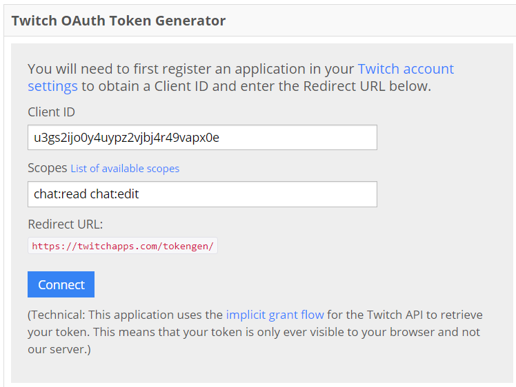
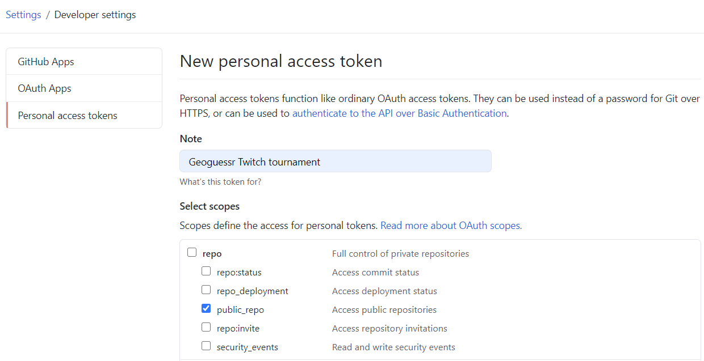
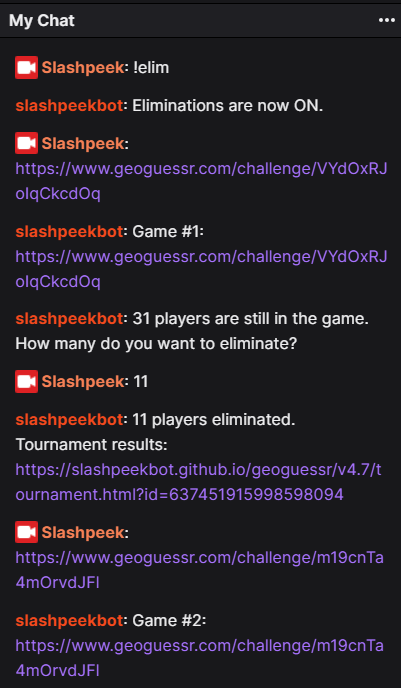

### First time setup
To run the application you need `GeoTourney.exe` and a valid `appsettings.json` file. The `appsettings.json` file is a text file that looks like this:

##### `appsettings.json`
```
{
  "TwitchChannel": "TWITCH_CHANNEL",
  "TwitchBotUsername": "TWITCH_BOT",
  "TwitchToken": "TWITCH_TOKEN",
  "GithubToken": "GITHUB_TOKEN"
}
```

Download and unzip the `GeoTourney.exe` and `appsettings.json` to a folder of your choice. Open that file in a text editor - now you will replace each of the upper case items with proper values.

###### TWITCH_CHANNEL
This is the streamer's channel/username on Twitch. Example `slashpeek`. The application listens to messages from this channel when it runs.

###### TWITCH_BOT
This is the Twitch account the application will send chat messages on behalf of. *Either* create a separate bot account or use your streamer account. Mark that the application is quite "conversational" so it most likely feels more natural to use a separate bot account so that it doesn't look like you're talking to yourself. Example: `slashpeekbot`.

###### TWITCH_TOKEN

1. Log into the Twitch account you decided to use for `TWITCH_BOT` above.
2. Go to https://twitchapps.com/tokengen/
3. Put `u3gs2ijo0y4uypz2vjbj4r49vapx0e` into the `Client ID` field.
4. Put `chat:read chat:edit` into the Scopes field.
5. Copy the token value and put it into your `appsettings.json` file.



###### GITHUB_TOKEN

1. Create a Github account. You can use an existing, but I can't recommend that. The program will put files into a `geoguessr` folder in the [Github Pages](https://pages.github.com/) repository.
2. After registering, completing the hilariously hard reCAPTCHA and signing in, go to https://github.com/settings/tokens and click `Generate new token`.
3. Check the scope `public_repo`.
4. Put `Geoguessr Twitch tournament` or similar in the `Note` field so you know what it's for.
5. Generate token.
6. Copy the token value and put it into your `appsettings.json` file.



### How to use
1. Run `Geoguessr.exe` by double clicking (or from command line). The first time this will take time as it downloads ~300 MB.
2. Then a browser opens. Log into the geoguessr account you will be playing with. NB: After logging in, minimize this browser window, you **cannot** use this as the browser you play in.
3. Send challenge links to the Twitch chat you're hosting, f.ex. `https://www.geoguessr.com/challenge/kdrp4V1ByTC2D7Qr` Only the link, nothing else.
4. The bot responds with `Game #1: https://www.geoguessr.com/challenge/kdrp4V1ByTC2D7Qr`.
5. Play the challenge after your audience has had some time. When finished the bot will post a link to results page, f.ex. https://slashpeekbot.github.io/geoguessr/v4.7/tournament.html?id=637451944357099056
6. Commands. These commands only work for the streamer/broadcaster.
  * `!totalscore` to get a results page with all games and points summed.
  * `!restart` to forget current tournament and start over.
  * `!endgame` to end the current game and record results.
  * `!game [parameters]` to create a challenge and start the game. Read more below. You should do this after you as a streamer have finished playing.
  * `!maps` to see which maps are available and what their shortcut/code is.
  * `!elim` to toggle elimination mode on/off.
  * `!elim slashpeek` to eliminate user `slashpeek`.
  * `!elim 22138` to eliminate the user with 22138 points in the last game.
  * `!revive slashpeek` to revive user `slashpeek`.
  * `!revive 8796` to revive user with 8796 points in the last game.
  * `!elim less than N` to eliminate all players with less than N points in the last game.
  * `!elim more than N` to eliminate all players with more than N points in the last game.
  * `!revive less than N` to revive all players with less than N points in the last game.
  * `!revive more than N` to revive all players with more than N points in the last game.



### Game/challenge creation
You can start a game two ways: 1) Post a challenge link to chat. 2) use the !game command.

#### The !game command
To create a game you can let GeoTourney create it for you. There are ~100 maps included by default. You can see which ones [here](https://slashpeekbot.github.io/geoguessr/maps.html?id=637457261045090844). All maps have a *shortcut* that is used to reference a single map and a *group* that is used to reference multiple maps. "A Diverse World" by Mapper has shortcut `adw` and a challenge link can be created by doing:

`!game adw`

Time limit: number in seconds. *Default 60.* 0 for no time limit.

`!game adw 40` for a game with 40 seconds time limit.

Game types: `move`/`nomove`/`nmpz`. *Default nomove*.

`!game adw 10 nmpz` for a no move, no pan, no zoom game.

##### Creating random games
You can let the program decided which map to use. The way you do so is to append `random` to the *group* you would like to pick maps from:

`!game randomworld` for a random game from within the 'world' group.
`!game randomcountry` for a random game from within the 'country' group.
`!game random` for a random game from all available maps.

These can also be combined with time limit and game type as described above.

##### Extending the !game command
You can have your own maps with shortcuts. Create a text file in the same folder as `GeoTourney.exe` called `maps.txt`. Then add one line for each map.

*Shortcut* {SPACE} *map id* {SPACE} *group*. Shortcut and group can be what you want. Map id is the last part of the URL in the browser when you're on a map. F.ex:

```
usmcd 5949f83fdbd032c678addfd7 mcdonalds
worldmcd 5754651a00a27f6f482a2a3d mcdonalds
polandmcd 5cc070366cca664ea81d8d9e mcdonalds
```

Now you can create games based on them (no restart). `!game polandmcd 60 move` / `!game randommcdonalds`

You can use `!maps` to verify that your map was "registered" correctly.

### Motivation, explanation, FAQ, ramblings
Basically I wanted to see an application that handled multi-game Geoguessr tournaments in a better way and let the users play on their computers. Secondly having a good presentation of results that was dynamic and available to everyone (not just on the streamer's machine) also after the games finish was a goal.

##### Technical decisions
Having few external dependencies and let those be rock solid, big actors. Not having a specific backend for this appliation is therefore a conscious decision. Instead it integrates with Twitch to receive messages/commands and Github to store and present results. I wanted each user of the application to have their own Github account and by such *they* are the owner of the tournament data and are not relying on any other user's decision to keep it running or not delete it.

Using Github essentially enabled the possibility to create a web site for each user and then create new, static pages for each game/tournament. That way anyone can see the results and it should be available for as long as the user wants to keep the results/account. Since each page is self-contained, there is no reason it shouldn't work even years from now. That way these result pages can be used as an "archive" by just keeping the URL somewhere, f.ex. enabling the possibility to do (more or less manual) aggregations across tournaments.

Since Github runs *so* much of the software of the world, availability should be very good and I'm not afraid of APIs suddenly breaking. This in great contrast to f.ex. Hastebin.

##### Issues/ideas
If you run into an issue, f.ex. the appliaction crashing, please head over to the [issues page](https://github.com/slashP/GeoTourney/issues). Please include the content from `errors.txt` in the same folder you have `GeoTourney.exe` if such a file is present.

If you have an idea for a feature, you can also post it as an issue and we can have a discussion on how it could work.